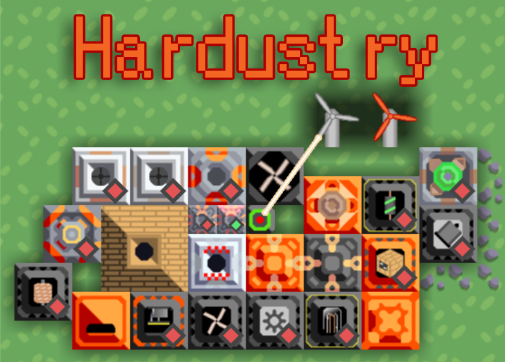

 
# Hardustry-mod

#### [#日本語](/README_JP.md)

## Important
This repository is no longer supported. A replacement mod is available [here](https://github.com/makizakao/HardustryExtended).

## What is this mod?
Hardustry mod is based on gregtech, known as a mod of Minecraft.
This mod makes Mindustry hard. This mod doesn't support iOS.

Hardustry Added Recipes, Materials, Factory and Turrets.
And performance of original blocks are changed into Hardustry specifications.

### One way to craft Metaglass
I'll introduce a way to build Kiln for example.

1. Produce Worker, Brass, and Bronze.  
2. Build PowerGenerator, BronzeSmelter, and BronzeHullFactory.
3. Craft Bronzehull.
4. Build Kiln.

But Kiln makes 1 metaglass from 5 sands, 5 leads, and 1 coal over 15 seconds.

## How to play Hardustry?
You need to read 
[Mindustry License](https://github.com/Anuken/Mindustry/blob/master/LICENSE) 
and [Hardustry License](/LICENSE) before using this mod.

## Attention
If you play Hardustry, Backup your research and campaign data.
They could be broken.

### Installation
Paste the `hardustry.zip` in your mod folder.

## Additional Items  

## Additional Buildings  

## More Information
If you want to get more information about Hardustry, visit official Twitter Page.

### Official Twitter: https://twitter.com/hardustry
